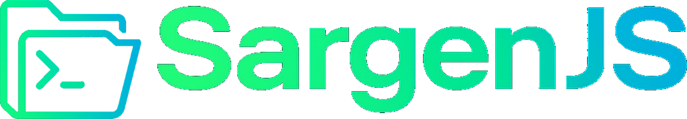

# SargenJS

<div align="center" >
  
</div>

🚀 **SargenJS** - A beginner-friendly CLI that builds a ready-to-use Express.js project. Just run the command to get routes, configs, and scripts so you can focus on writing features, not boilerplate & base configurations.

---
> **📝 Important Note:** Everything SargenJS generates is default compatible and follows CommonJS module structure. For ESModule support, developers need to manually transfer/migrate files after generation.

## Key Features
> **🎯 Base Configured Layer**: SargenJS provides a complete base configured layer 
for backend development, allowing developers to focus on writing business logic 
rather than setting up infrastructure, security, and boilerplate code.

- **🚀 Project Generation** - Express.js projects with Layered (MVC) or Modular architectures
- **🗄️ Database Integration** - Sequelize ORM with MySQL/PostgreSQL and Docker support
- **🔧 Module Generation** - Auto-generate CRUD APIs with controllers, routes, services, and models
- **🔒 Security Middlewares** - JWT authentication, ACL, validation, and rate limiting
- **📊 Monitoring Stack** - Prometheus, Grafana, and Loki with Docker integration
- **⚡ Utility Services** - Redis, SMTP email, and push notifications
- **📝 Git Integration** - Automatic GitHub repository setup with GitHub CLI
- **🐳 Docker Support** - Centralized Docker Compose for all services

## 📚 Documentation

**🔗 [SargenJS Full Documentation](https://sargenjs-docs.vercel.app)** - Complete guides & examples.


## 🤝 Contributing

> **Note:** Currently, SargenJS is not accepting open contributions. The project 
is initially maintained and handled by the SargenJS development team. We 
appreciate your understanding and will announce when contribution guidelines 
become available.

## Installation

```bash
npm install -g sargenjs
```

## Quick Start

### 1. Create a new project
```bash
# Default layered architecture
sargen init my-project

# Modular architecture
sargen init my-project --struct modular
```

### 2. Run the project
```bash
cd my-project
npm run dev
```
Your app will be available at: http://localhost:8000

## Essential Commands

### Setup & Configuration
```bash
# Setup "Sargen" into existing project
sargen setup

# Database with Docker (Default MySQL & Sequelize)
sargen gen:db --docker

# Generate module with CRUD (Along with model attributes)
sargen gen:module users --crud --model-attributes name:string,email:string

# Supported Data Types:
# - Basic: string, number, integer, boolean, float, date
# - Foreign Keys: ref(modelName) - requires quoting for shell compatibility
# - Enums: enum(value1|value2|...) - up to 10 values, requires quoting
# Example with foreign key and enum:
sargen gen:module orders --crud --model-attributes "order_number:integer,product_id:ref(products),status:enum(pending|completed|cancelled)"

# Add middleware
sargen gen:middleware auth
sargen gen:middleware validator

# Setup Git repository
sargen gen:git
```

### Quick Examples
```bash
# Complete project setup
sargen init my-api
cd my-api
sargen gen:db --docker
sargen gen:module products --crud --model-attributes title:string,price:number
sargen gen:module orders --crud --model-attributes "product_id:ref(products),quantity:integer"
sargen gen:middleware auth
sargen gen:git
```

**📖 [View All Commands](https://sargenjs-docs.vercel.app/commands)** - Complete command reference with examples

## License

This project is licensed under the ISC License - see the [LICENSE](LICENSE) file for details.
